<div align="center">
  
  <h1>OpenNFCT</h1>
  <p><strong>Open NFC Toolkit — read, write, clone, and emulate NFC tags on Android</strong></p>

  
  
  
</div>

---

OpenNFCT is a free, open-source Android app for working with NFC tags. It covers the full tag lifecycle — scan a tag to inspect its contents, write new records, clone it to another tag, erase it, or emulate it from your phone. MIFARE Classic, NTAG, and ISO-DEP tags are all supported.

## Features

- **Read** — Scan any NFC tag and see its UID, tag type, ATQA/SAK, tech stack, and all NDEF records decoded into human-readable form.
- **Write** — Write plain text, URLs, email addresses, or phone numbers to a tag. Load a `.onfct` file to restore a full tag dump. Unformatted tags are automatically formatted before writing.
- **Memory Manager** — Browse raw tag memory as hex, UTF-8, ASCII, or binary. Inspect NDEF record structure and type. Export or copy in any format, or save as a `.onfct` file.
- **Erase** — Overwrite all NDEF records on a tag with an empty message.
- **Format** — Initialise an unformatted tag so it can store NDEF data.
- **Clone** — Copy the full memory of one tag to another. Supports MIFARE Classic sector-by-sector auth and write, NTAG/Type 2 raw page cloning, and NDEF fallback. Import/export raw dumps as `.bin` files.
- **Emulate** — Use Android HCE to emulate a tag from a `.onfct` file, making your phone act as an NFC Type 4 tag.

## Supported Tags

| Family | Examples |
|---|---|
| NFC Type 2 / NTAG | NTAG213, NTAG215, NTAG216, Mifare Ultralight |
| MIFARE Classic | Classic 1K, Classic 4K, Mini |
| ISO-DEP / Type 4 | Most modern contactless cards and stickers |
| NFC-A / NFC-B | Generic low-level access |

> **HCE emulation note:** Android can only emulate ISO-DEP (Type 4) cards. Emulating a MIFARE Classic tag will work with readers that support ISO-DEP, but will be rejected by readers that exclusively accept MIFARE Classic (most access-control systems).

## Installation

No Play Store required — just sideload the APK.

1. Download `OpenNFCT.apk` from the [latest release](../../releases/latest).
2. On your Android device, go to **Settings → Apps → Install unknown apps** and allow installs from your browser or file manager.
3. Open the downloaded APK and tap **Install**.

## Building from Source

**Requirements:** Node.js 18+, JDK 17+, Android SDK.

```bash
git clone https://github.com/Miky8745/OpenNFCT.git
cd OpenNFCT
npm install
```

**Debug build (connected device or emulator):**
```bash
npm run android
```

**Release APK:**
```bash
cd android
./gradlew assembleRelease
# Output: android/app/build/outputs/apk/release/app-release.apk
```

> A keystore is required to sign a release build. See the [Android signing guide](https://developer.android.com/studio/publish/app-signing) if you haven't set one up.

## File Formats

### `.onfct`
A JSON snapshot of a scanned tag — includes tag metadata, all decoded NDEF records, and the raw page dump where available. Use it to back up a tag, restore it to a new tag via Write, or emulate it via HCE. Exported from the Memory Manager.

### `.bin`
A raw binary memory dump, compatible with other NFC tools. OpenNFCT auto-detects the tag type from the file size on import:

| File size | Interpreted as |
|---|---|
| 320 bytes | MIFARE Classic Mini |
| 1024 bytes | MIFARE Classic 1K |
| 4096 bytes | MIFARE Classic 4K |
| Multiple of 4 | NFC Type 2 / NTAG pages |
| Other | Raw NDEF bytes |

## License

MIT
